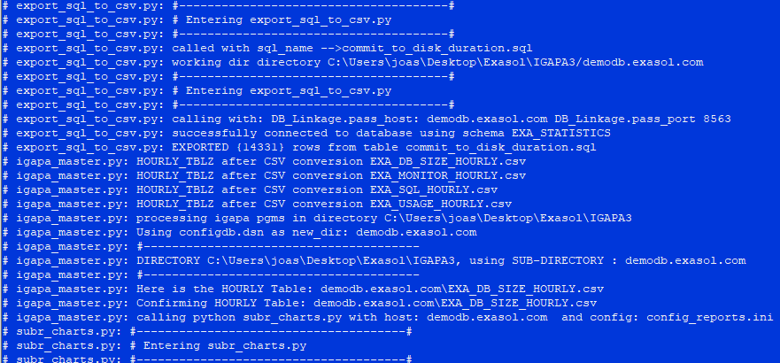
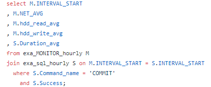
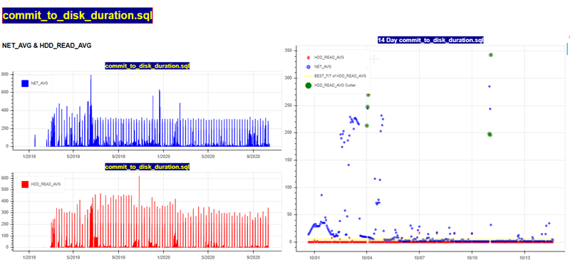

# igapa3
Igapa (Interactive Graphics About Performance Analysis) with configurable settings and flexibility to pick and choose formats and options. You can pull from Jira or from DB, run using config files or the commandline, and add your own SQL to visualize. You can configure the charts to any size, configure the "ceiling" for the outlier algorithm to flag anomalies, the number of days or hours to display in the default daily chart showing hourly history for the week, etc. Sounds complex? Relax, we have set up default configurations for you, so just follow the section, "Quick setup of 2 configuration files" and you can start seeing charts.

## Overview
The point of this Python tool is to plot Exasol database system data (performance numbers) on charts using the BOKEH application. The system data can be extracted from CSV files attached to a JIRA ticket or pulled directly from a database. 

### Inputs
There are 2 kinds of inputs:

a. Configuration files which hold your default, repetitive information, such as which database, connection credentials and reporting parameters to run.

b. Commandline parameters which override the configuration files (limited to database connectivity or whether to extract data from a JIRA ticket and not the database.)

*** Note: The commandline parameter "-c" is required, which drives which reports to create. Without this, the "help" or "usage" information is displayed.

c. Optional user queries which allow the user to drive their personal monitoring information.

### Outputs
1. The primary output are the visualizations. Multiple web pages are generated to separate and organize the reporting outputs. 
2. Output logs - most of the programs and utility tools generate a paper (text file) log showing their activity contents.
3. Compreshenisve commandline displays of each programs's log - so you can see where you are within a running job and what that particular program is doing.

# Usage
## Help
-c: Config_file override. You must specify which config to use for reporting.
      --> The default config included is config_reports.ini.
      
-j:   Jira Source. The JIRA ticket number which has the CSV attachments

-k:   Jira user. Logon credential for JIRA. Overrides config_admin.ini

-l:   Jira password. Logon credential for JIRA. Overrides config_admin.ini

-m:   Database host name or I.P. address. Overrides _config.py

-n:   Database host port. Overrides _config.py

-u:   Database user logon credential. Overrides _config.py

-p:   Database user password credential. Overrides _config.py

-s:   Database schema. Overrides _config.py

-h:   Usage help

# Quick setup of 2 configuration files.

Update these appropriately for automation defaults.

1. _config.py - holds the default database connection credentials. 

2. config_admin.ini - First paragraph holds credentials to access our JIRA system.

# Automation - using the config files to drive connectivity.

**_config.py** - holds the DB connection string parameters (db, port, user, pw, schema).

**config_admin.ini** - Among other things, holds the JIRA credentials if you are extracting CSV from JIRA ticket.

### Execution example:
Process and visualize the database defined in **_config.py*        >>> **python igapa3.py -c** _config_reports.ini_

Process and visualize CSV files attached to JIRA ticket EXA-28727  >>> **python igapa3.py  -c** _config_reports2.ini_   **-j** _28727_

# Command line overrides

Show parameters for igapa3.py >>> **python igapa3.py**

Pull database data using overrides >>> **python igapa3.py -c config_report2.ini -m 192.168.1.158 -n 8563 -u sys -p secret**

Pull JIRA files attached to ticket EXA-28615 using overrides >>> **python igapa3.py -c config_report2.ini - j 28615 -k exasol_user -l exasol_password**

# (ALPHA (beta testing) FEATURE) Roll your own monitoring using the sql directory
## Overview:
You can run and visualize simple queries if you create a folder named sql in the same directory as igapa3.py. Inside the sql folder you can drop your queries. If you are running igapa3.py and using the database parameters (not using the JIRA ticket parameters), then the simple queries will be processed and the output visualized. 

## SQL Criteria
1. The user query must meet this format:
COLUMN_1 is a date or timestamp
COLUMN_2...COLUMNx must be populated with numeric data, as we are plotting the data on the cartesian plane (x-axis and y-axis).

2. The user query must reside inside the folder named sql.

3. All scalar functions, such as date formatting or "sum(some_column) MUST use a synonym as the ending of statement, such as **, TO_CHAR(interval_start, 'YYYY-MM-DD HH24') as my_synonym**.

4. The sql folder only contains queries - do not create additional folders or anything else inside the sql folder.

 

## Currently there are 2 known bugs with using SQL:
1. If you have an odd number of result columns (excluding the date column), the SQL visualization will fail. Best to keep customized SQL returning only 1 or 2 columns.

# Subroutines and Tools
**_config.py** - Database connectivity parameters such as credentials (Defaults for automation).

**config_admin.ini** - JIRA credentials, logging level and visualization properties.

**config_reports.ini** - Visualization properties, which tables and columns to visualize.

**config_report2.ini** - Alternative visualization properties, which tables and columns to visualize.

**config_report3.ini** - Special System table alternative visualization properties, which tables and columns to visualize.

**export_cloud_to_csv.py** - Creates directory of server_name (from *_config.py*) and extracts a single database table to local csv using same name.

**export_sql_to_csv.py** - Reads user sql and extracts CSV.

**export_JIRA_to-csv.py** - Passed EXA- ticket and calls *subr_jira_download.py*.

**igapa2_linkage** - Utility to pass parameters. Included in most of the programs.

**igapa_master** - Decides to call processes to Oownload JIRA files or download files from the database.

**igapa2.py** _Handles program(s) linkage and runs igapa2_validate_config_{jira / db}.py_

**igapa2_main.py** _Validates linkage parameters and calls igpapa_master.py_

**igapa2_main** - Reads igapa2_linkage and calls igapa_master.py using parameters/arguments.

**igapa2_validate_config_db.py** - Reads igapa2_linkage and calls igapa2_main.py using linkage parameters.

**igapa2_validate_config_jira.py** - Validates the JIRA parameters and calls igapa2_main.py using linkage parameters.

**igapa3.py** _MAIN PROGRAM to execute_

**subr_jira_download.py** - Passed EXA- ticket and downloads EXA- ticket attached files.

**subr_char_4_rows.py** - Reads config file and builds charts.

**subr_validate_ticket.py** - Validate JIRA ticket exists on system.

**test_get_config_tbls.py** - Reads config file, extracts Tables and calls *export_cloud_to_csv.py*.

**tools_create_config.py** - Creates the config_report(x).ini for each sql in the ./sql folder

**tools_get_table_cols.py** - Pass in table, get back table columns

**tools_logger.py** - Set up logging. Imported by programs using logging.

**tools_parse_config.py** - Utility to validate the configuration files used. (such as config_admin.ini, config_reports.ini, etc.)
